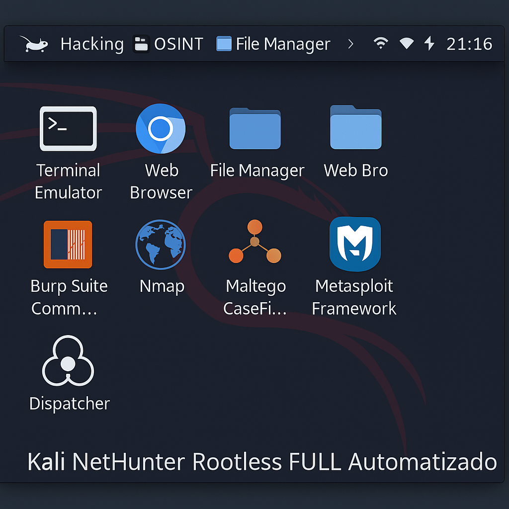

# Kali Rootless Installer



Un conjunto de scripts para instalar y gestionar de forma sencilla una instancia de Kali Linux en un entorno **rootless**, ideal para aplicaciones como Termux en Android. Accede a las herramientas de Kali sin necesidad de rootear tu dispositivo.

---

## Características

- **Instalación Automatizada:** El script `install.sh` descarga e instala una imagen base de Kali Linux.
- **Acceso Fácil:** El script `kali.sh` inicia sesión en el entorno Kali de forma rápida.
- **Ligero y Rootless:** No requiere privilegios de superusuario, manteniendo la seguridad de tu sistema base.
- **Soporte para Sonido:** Incluye configuración básica para `pulseaudio`.

---

## Requisitos Previos

Antes de empezar, asegúrate de tener lo siguiente:

- **Termux:** Una versión actualizada desde [F-Droid](https://f-droid.org/en/packages/com.termux/). Las versiones de la Play Store están obsoletas y no funcionarán.
- **Almacenamiento:** Al menos 5 GB de espacio libre en el almacenamiento interno.
- **Dependencias:** Los siguientes paquetes deben estar instalados en Termux. El script de instalación intentará instalarlos automáticamente.
  - `wget`
  - `proot`
  - `tar`
  - `pulseaudio`

---

## 🚀 Instalación y Uso

### 1. Clonar el Repositorio
Abre Termux y ejecuta los siguientes comandos:

```bash
# Actualiza los paquetes de Termux
pkg update && pkg upgrade -y

# Instala git para clonar el repositorio
pkg install git -y

# Clona este repositorio
git clone [https://github.com/Dazka001/kali_rootless.git](https://github.com/Dazka001/kali_rootless.git)

# Entra en el directorio
cd kali_rootless
```

### 2. Ejecutar el Script de Instalación
Dale permisos de ejecución al script `install.sh` y lánzalo:

```bash
chmod +x install.sh
./install.sh
```
El script descargará la imagen de Kali (~1.5 GB) y la descomprimirá. Este proceso puede tardar varios minutos dependiendo de tu conexión a internet.

### 3. Iniciar Kali Linux
Una vez terminada la instalación, puedes iniciar sesión en tu nuevo entorno Kali en cualquier momento con:

```bash
./kali.sh
```
¡Y listo! Estarás dentro de la terminal de Kali Linux.

---

## Detalles de los Scripts

- `install.sh`: Realiza la instalación principal. Descarga la imagen `kali-linux-arm64-rootfs.tar.gz`, la extrae y configura los directorios necesarios.
- `kali.sh`: Es el lanzador principal. Utiliza `proot` para iniciar una sesión de shell dentro del entorno de Kali, montando los directorios vitales del sistema (`/dev`, `/proc`, etc.) y configurando el servidor de sonido `pulseaudio`.

---

##  Troubleshooting y FAQ

Aquí tienes soluciones a problemas comunes.

**P: El script `install.sh` falla con un error de "404 Not Found".**
**R:** La URL de descarga de la imagen de Kali puede haber cambiado. Abre el archivo `install.sh` y verifica que la variable `KALI_URL` contenga un enlace válido. Puedes buscar la última versión en la [página oficial de Kali](https://www.kali.org/get-kali/#kali-bare-metal).

**P: Recibo un error de `proot` al ejecutar `kali.sh`.**
**R:** Asegúrate de que `proot` está instalado correctamente (`pkg install proot`). También verifica que la instalación no se haya corrompido. Si el problema persiste, intenta borrar el directorio `kali-fs` y ejecuta `install.sh` de nuevo.

**P: No tengo sonido en las aplicaciones gráficas de Kali.**
**R:** El script `kali.sh` intenta iniciar `pulseaudio`, pero la configuración puede variar. Asegúrate de haber instalado `pulseaudio` en Termux (`pkg install pulseaudio`) y de haberlo iniciado (`pulseaudio --start`).

**P: ¿Cómo actualizo los paquetes dentro de Kali?**
**R:** Una vez dentro del entorno Kali (después de ejecutar `./kali.sh`), puedes usar `apt` como de costumbre:
```bash
apt update
apt upgrade
```

---

## Contribuir

¡Las contribuciones son bienvenidas! Si quieres mejorar este proyecto, por favor lee el archivo [CONTRIBUTING.md](CONTRIBUTING.md) para conocer las pautas.
